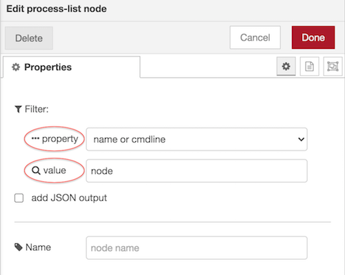
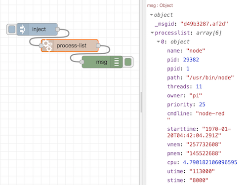
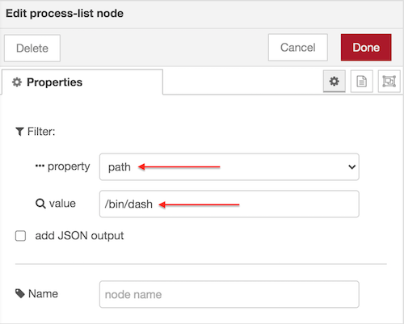
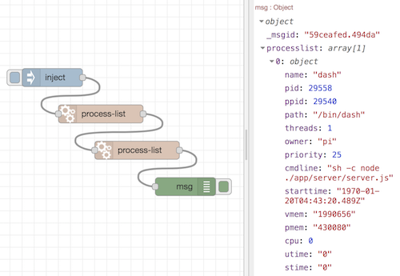

# node-red-contrib-process-list
Simple node to get list of running processes/tasks on server hosting Node-Red. It's based on [Process-list](https://www.npmjs.com/package/process-list) module.

## Install
Install from PALETTE Manager or run the following command in your NODE-RED user directory typically: \~/.node-red
```
npm install node-red-contrib-process-list
```
## Usage
Use the editor to filter output with search string (`value`) against specified property (`property`).
Process details are returned in output array when propery's value contains search term, the match is **case insensitive**. You can specify a search term with `msg.tasksearch` input property also.
`property` must be selected using the editor. Default is 'name or cmdline'. If at least one of these 2 property's value contains search term the process will be returned in output array. When no process are returned from filter (array with no items), the node outputs an empty string.
To get info on a specific process use editor and configure a filter based on property value.

example: filter processes where `name` or `cmdline` contains the search term: 'node'.


returns an array with 6 processes



Cascade filters are available when 2 or more nodes are join together.

so lets add second node to filter first node search results. Set `value` to '/bin/dash' and the `property` to 'path'.



returns only one task from the 6 given before in input



**Do not self join the node (using link in/out nodes) to avoid memory leaks**.

### Input
`msg.tasksearch` string term used to filter processes overwriting `value` specified in the editor. It is case insensitive. To get all processes do not use this input and leave editor field `value` empty. If this input is not a string it will be evaluated as an empty string therefore editor field `value` will be used if not empty otherwise no filters will be applied and all processes will be returned in output.

`msg.processlist` is array of objects used internally to cascade filter processes. Join together multiple node to apply more filters.
### Output
`msg.processlist` array of objects containing the following properties: `pid, name, cmdline, ppid, path, threads, owner, priority, starttime, vmem, pmem, cpu, utime, stime`.

`msg.processlistJSON` JSON array of objects.

Tested on raspbian 10 - 32bit. Should work on all Linux distro and Windows 7 and earlier.
